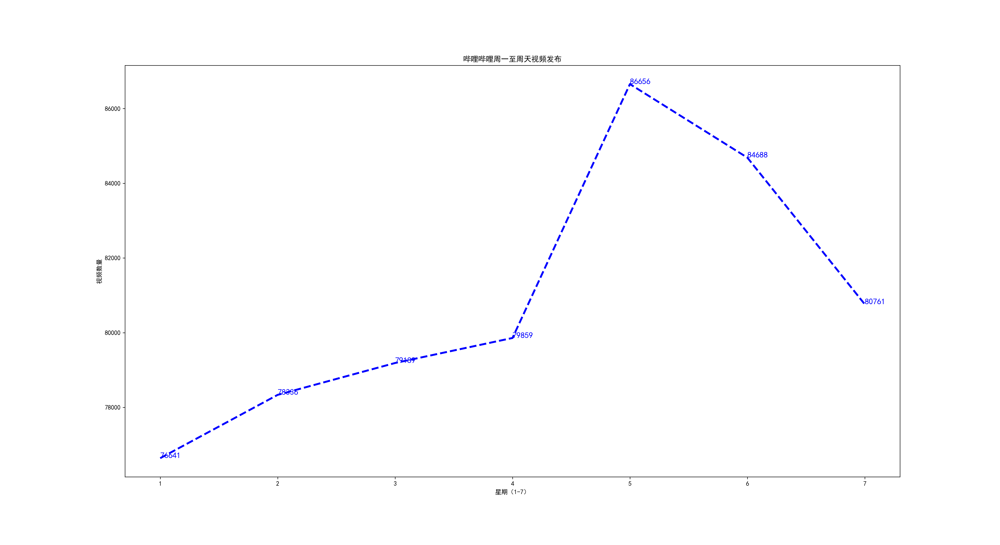
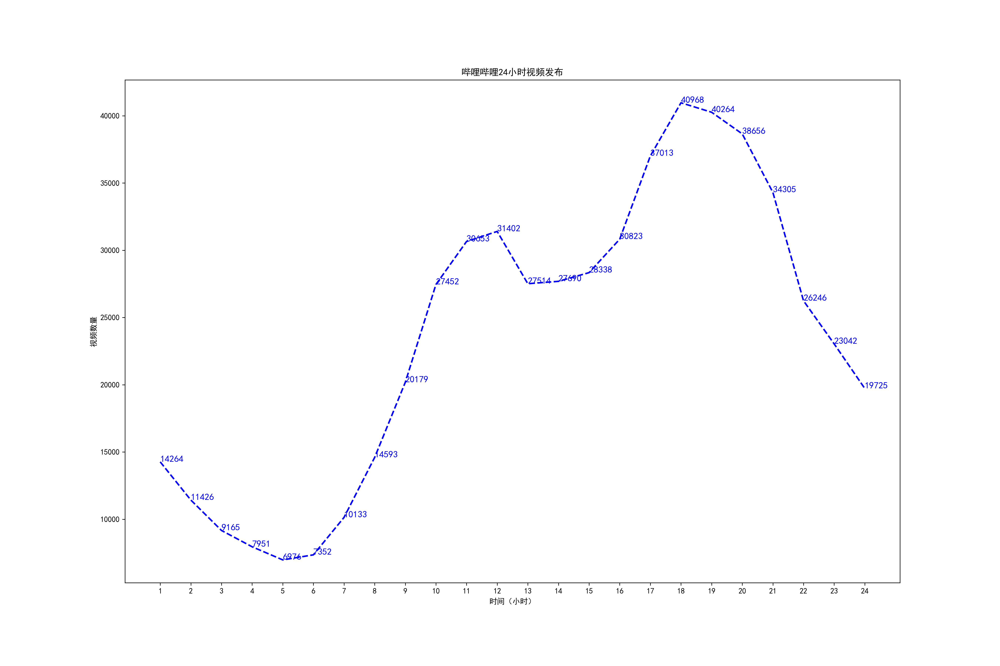

# 2019年六月前哔哩哔哩视频数据分析
## 项目内容
* 抓取2016年至今视频发布数、2019年六月前哔哩哔哩**播放数1万**以上视频数据、及视频播放数超 50w 作者信息、以及抓取视频中播放数前 1w 部视频弹幕及热评。
* 使用**标签**或直接对视频发布数、播放数、收藏数、评论数、弹幕数、及作者粉丝数、视频数进行绘图定量分析。
  * 哔哩哔哩全站2016至今每月各分类下视频发布数量；
  * 播放量过 1w 视频信息抓取，包括发布时间，播放数等；
  * 科技类下播放量过 1w 的发布数、播放数等指标分析；
  * 抓取到播放数超 50w 作者信息抓取；
  * 播放量前 1w 视频弹幕及热评分词分析。
## 项目思路
1. 使用哔哩哔哩视频、作者信息、弹幕、热评 api 接口进行数据抓取，并使用 **MongoDB** 存储；
2. 分析哔哩哔哩全站视频发布量月变化、及分析播放数、收藏数、评论数等靠前的“最热”标签。
## 运行环境
* python3.7
* Windows
* jupyter notebook
## 运行依赖包
* requests
* matplotlib
* numpy
* pymongo
* pickle
## 文件说明
### spider_code 文件夹
* 抓取的2019年六月前哔哩哔哩播放数1万以上视频代码;
* 抓取的2019年六月前哔哩哔哩播放数前1万以上视频弹幕及热评代码;
* 抓取哔哩哔哩2016年至今每月各分类视频发布数代码；
* 抓取已抓取的播放数超 50w 视频的作者信息代码；
* 抓取 video 详细信息，以便获取获得弹幕的 cid代码。
### picture_code 文件夹
本项目需大量使用 matplotlib 绘图，因此绘图部分使用 jupyter notebook。此处强烈推荐用于数据分析，方便快捷；
### picture 文件夹
按照发布量、标签、作者、弹幕及热评分类放置相关的**图像**。
### pickle_file 文件夹
为方便绘图，部分数据在本项目使用序列化数据存储变量，pickle_file 文件夹放置本代码所需的序列化文件。
## 一些建议
* 爬取时大部分数据为 json 格式，推荐使用 MongoDB 存储数据;
* 绘图库使用 matplotlib，官方示例<https://matplotlib.org/>；
* 对于经常使用的较大的变量可以使用 pickle 序列化。
## 部分图片展示
* 哔哩哔哩2016年至今每月各分类视频发布条形图
 
* 哔哩哔哩2016年至今每天视频发布变化图
 
* 哔哩哔哩2019年6月前视频星期发布变化图
 
* 哔哩哔哩2019年6月前视频小时发布变化图
 
* 哔哩哔哩2016年至今播放数前 1w 视频词云
 
* 哔哩哔哩2016年至今科技类每月各分类视频发布条形图
 
* 哔哩哔哩2019年6月前科技类视频星期发布变化图
 
* 哔哩哔哩2019年6月前科技类视频小时发布变化图
 
